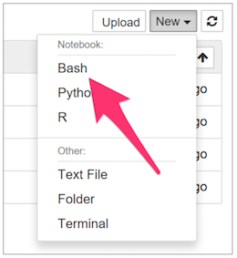

# Configuración de Ubuntu

Esta guía describe el proceso de instalación de Python, IPython, R, Jupyter y los kernels para Jupyter de R (IRkernel) y Bash (IBash) en Ubuntu.


### Paso 1
Para abrir Terminal, haga click en el ícono de búsqueda. Escriba **`Terminal`**, y haga click en el ícono de la aplicación.


### Paso 2
Ejecute el siguiente comando para descargar el script de instalación:

```
wget https://raw.githubusercontent.com/jdvelasq/CDA-01-instalacion/master/ubuntu.sh
```


### Paso 3
Una vez finalice la descarga, ejecute el script con:

```
bash ./ubuntu.sh
```

Este atento a las indicaciones del prompt. Cuando el instalador le pregunte si agrega Anaconda al path del sistema, responda **`yes`**. En varias ocasiones se le solicitar su password para realizar el proceso.


### Paso 4
Verifique que jupyter se encuentra funcionando correctamente. Abra Jupyter:
```
jupyter notebook
```

En el menú **`New`** de Jupyter debe aparece la opción de crear notebooks en
Bash.


