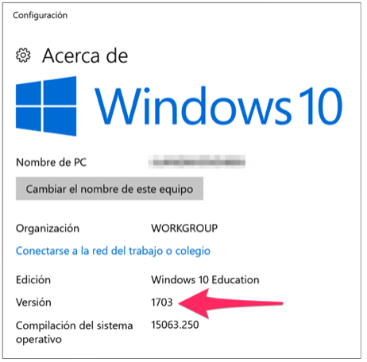
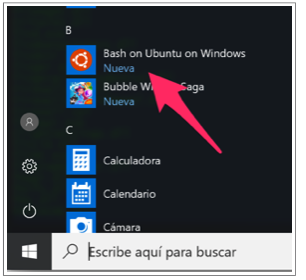
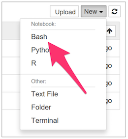

# Configuración de Windows 10

Esta guía describe el proceso de instalación del *Ubuntu on Windows* disponible
en Windows 10 Anniversary Update, Windows 10 Creators Update o posterior
(Compilación 1607+). Seguidamente, se describe la instalación en el Bash de
Anaconda (que incluye Python, IPython y Jupyter), el lenguaje R, RStudio y los
kernels para Jupyter de R (IRkernel) y Bash (IBash).


### Paso 1
Verifique que su instalación de Windows 10 permite la configuración de Ubuntu.
Haga clic derecho sobre el logo de Windows. Abra
**`Configuración > Sistema > Acerca de`**.


### Paso 2
Verifique la compilación en la ventana **`Acerca de`**. Su compilación debe ser 1607 o superior. Si su equipo no cumple este requisito, actualice su versión del sistema operativo.



### Paso 3
Haga click derecho sobre el logo de Windows, abra **`Configuración`** y baje hasta **`Actualización y Seguridad`**.


### Paso 4
Haga click en **`Para Programadores`**.

### Paso 5
Seleccione el **`Modo de Programador`**. Windows instalará los paquetes del modo de programador.

### Paso 6
Haga click con el botón derecho en el logo de Windows en la barra de tareas y abra el **`Windows PowerShell (Administrator)`**.

### Paso 7
Ejecute el siguiente comando en el PowerShell para activar el Subsistema de Linux

```
Enable-WindowsOptionalFeature -Online -FeatureName Microsoft-Windows-Subsystem-Linux
```

### Paso 8
Ejecute el comando
```
Bash
```
en el Powershell. El sistema instalará
**`Ubuntu-on-Windows`** desde la tienda de aplicaciones de windows.


### Paso 9
Continue con la configuración del prompt respondiendo las preguntas realizadas por el instalador. Debe suministrar un nombre de usuario y contraseña. Cuando finalice la instalación, debe encontrar la aplicación Bash instalada en el sistema.




### Paso 10
Ejecute el siguiente comando para descargar el script de instalación:

```
wget https://github.com/jdvelasq/CDA-01-instalacion/edit/master/ubuntu.sh
```


### Paso 11
Una vez finalice la descarga, ejecute el script con:

```
bash ./ubuntu.sh
```

Este atento a las indicaciones del prompt. Cuando el instalador le pregunte si agrega Anaconda al path del sistema, responda **`yes`**. En varias ocasiones se le solicitar su password para realizar el proceso.


### Paso 12
Verifique que jupyter se encuentra funcionando correctamente. Abra Jupyter:
```
jupyter notebook
```

En el menú **`New`** de Jupyter debe aparece la opción de crear notebooks en
Bash.


